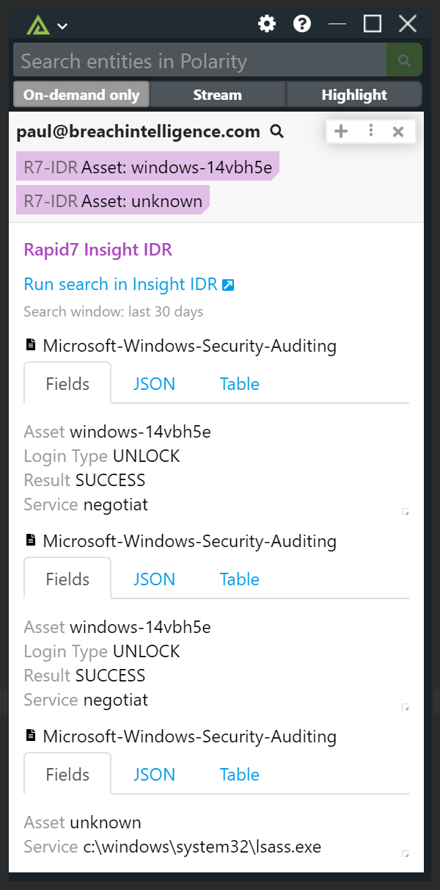

# Polarity Rapid7 Insight IDR Integration

|  ||
|---|---|---|
|*log query example* |*groupby query example*| *calculate query example*|

The Polarity Rapid7 Insight IDR Integration allows you to easily Query Emails, IP Addresses, Domains, and URLs in Query Logs. The integration supports regular `WHERE` queries as well as `groupby` and `calculate` queries.

To learn more about Rapid7 Insight IDR, visit the [official website](https://docs.rapid7.com/insightidr/).


## Rapid7 Insight IDR Integration Options

### Rapid7 Insight IDR API Key
Your API key for Rapid7 Insight IDR. To see how to create a new API Key, you can [View Rapid7's Documentation](https://docs.rapid7.com/insight/managing-platform-api-keys/)  

### Rapid7 Region Code
The API Region Code that will be used to search Rapid7's API. To check your data region, you can [View Rapid7's Documentation](https://docs.rapid7.com/insight/navigate-the-insight-platform/#check-your-data-region).

### Op Code

The alpha-numeric op code from the search app URL which can be found as "https://<region>.idr.insight.rapid7.com/op/{code}". The `op code` value should not include the trailing `#`.

### Log Search Query
The query you want to run when searching Rapid7 Log Data. The query follows the [LEQL querying format](https://docs.rapid7.com/insightidr/build-a-query/#log-entry-query-language-leql), and must contain the variable `{{ENTITY}}` in order for the search to be executed properly.  The variable represented by the string `{{ENTITY}}` will be replaced by the actual entity (i.e., an IP, hash, or email) that Polarity recognized on the user's screen. For example, the default query is `where({{ENTITY}})` which searches for any place in the logs where the entity appears.

The integration supports running `groupby` queries and will automatically adjust how data is displayed to account for this query syntax: 

```
where({{ENTITY}}) groupby(source_asset)
```

Additionally, you can also run `calculate` queries:

```
where({{ENTITY}}) calculate(count)
```

```
where({{ENTITY}}) max(bytes)
```

### Log Sets to Query

A comma delimited list of log sets you wish to query. Log set names are case-sensitive.

> If you use a `groupby` in your query when searching multiple log sets, the field that you group on must be found in both log sets to get results. If a log set does not contain the `groupby` field you will never get any results even if the `where()` portion of the query has matches.

### Log Query Time Range
The amount of time back you would like to see logs from. Supported values include: 
- `yesterday`
- `today`
- `last x timeunits` where x is the number of time unit back from the current server time. Supported time units (case insensitive): 
   -  min(s) or minute(s)
   -  hr(s) or hour(s)
   -  day(s)
   -  week(s)
   -  month(s)
   -  year(s).

### Document Title Field

"message" field to use as the title for each returned document in the details template.  This field must be returned by your log query. If left blank, the log id will be used. This option should be set to "Users can view only".

### Summary Fields

Comma delimited list of field names to include as part of the summary tags.  JSON dot notation can be used to target nested attributes starting inside the "message" object. Fields must be returned by your search query to be displayed.  You can change the label for your fields by prepending the label to the field path and separating it with a colon (i.e., "<label>:<json path>").  If left blank, a result count will be shown. This option should be set to "Only Admins can View and Edit".

### Display Fields

Comma delimited list of field names to include as part of the details block.  JSON dot notation can be used to target nested attributes starting inside the "message" object. Fields must be returned by your search query to be displayed.  You can change the label for your fields by prepending the label to the field path and separating it with a colon (i.e., "<label>:<json path>").  If left blank, no fields tab will be shown. This option should be set to "Only Admins can View and Edit".

### Max Log Results Shown

The maximum number of Investigation results shown on the Investigations tab, and the maximum number of Query Logs shown on the Logs tabs.

### Show No Results

If checked, the integration will return a message indicating there were no search results. Note that `calculate` queries always return a result regardless of this setting.

## Installation Instructions

Installation instructions for integrations are provided on the [PolarityIO GitHub Page](https://polarityio.github.io/).


## Polarity

Polarity is a memory-augmentation platform that improves and accelerates analyst decision making.  For more information about the Polarity platform please see:

https://polarity.io/
